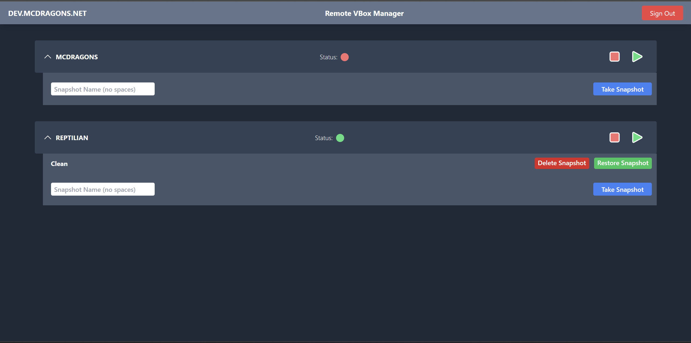

# Remote VirtualBox Manager

This is an application to manage virtualbox machines remotely via a web brower.



## Getting Started

1. Clone this repository<br/>
   ```bash
   git clone https://github.com/haroonsyed/remote-vboxmanager.git
   ```
2. Install the dependencies<br/>
   ```bash
   npm install
   # or
   yarn install
   # or
   pnpm install
   ```
3. Setup the environment variables
   ```env
   REMOTE_VBOX_USER=username
   REMOTE_VBOX_PASSWORD=password
   REMOTE_VBOX_SECRET=secret key for jwt
   VBOX_MANAGE_PATH=C:\Program Files\Oracle\VirtualBox\VBoxManage.exe // Path if running on windows
   NEXTAUTH_URL=http://localhost:3000 // The url should match baseurl
   ```
4. Start the server (use start for production)
   ```bash
   npm run dev
   # or
   yarn dev
   # or
   pnpm dev
   ```
5. Port forward, and/or put behind a reverse proxy to have domain/ssl support (a good idea to protect user/password).

Open [http://localhost:3000](http://localhost:3000) with your browser to see the result.

## Tech Stack

- NextJS
- Tailwind CSS
- NextAuth
- Typescript

## Need

A friend running an apple silicon mac could not run an x64 ubuntu OS for their classwork. I was running the VM remotely so they could ssh, but when the server crashed, or kernel edits made that broke the OS, it could not be managed without me manually restoring.<br/>

As a temporary solution, I was giving remote access to my full personal computer. So instead I decided to give secure remote access via a limited web interface.

The requirements are outlined below:

- Run on windows (I don't have a dedicated linux host to run this in)
- See status of server
- Start Server
- Stop Server
- Take snapshots of server
- Restore snapshots of server
- Be secure and not affect personal computer

There are existing solutions, but setting up a XAMP server was tedious, system-heavy, and I was getting random php errors on windows (not very plug and play). I also wanted to keep the scope of the application limited.

## Features

- Secure login with rate limitations to avoid brute force attack
- A simple, clean UI that looks modern
- Ability to view running status of servers
- Start and Stop servers
- Take snapshots of servers
- Restore snapshots of servers
- Automatic refresh

## Limitations

I created this application for a specific need, and it has a very narrow scope. I do not plan on adding more features like changing resources, networking settings, hdd settings and automatic logging/reporting.

At that point linux should be used with one of the following tools: <br/>
https://github.com/phpvirtualbox/phpvirtualbox<br/>
http://knobgoblin.org.uk/
